```{r setup, include=FALSE}
knitr::opts_chunk$set(echo = FALSE)
library(tidyverse)
library(knitr)

```


# Block or remove distractions {.tabset}
## Block access
If particular websites or apps distract you, try blocking your access to them for some time or after a certain amount of time has passed.

### Laptop
The most popular website blocker for **Chrome** is [Block Site - Website Blocker for Chrome™](https://chrome.google.com/webstore/detail/block-site-website-blocke/eiimnmioipafcokbfikbljfdeojpcgbh/related?hl=en):
```{r, out.width="45%"}
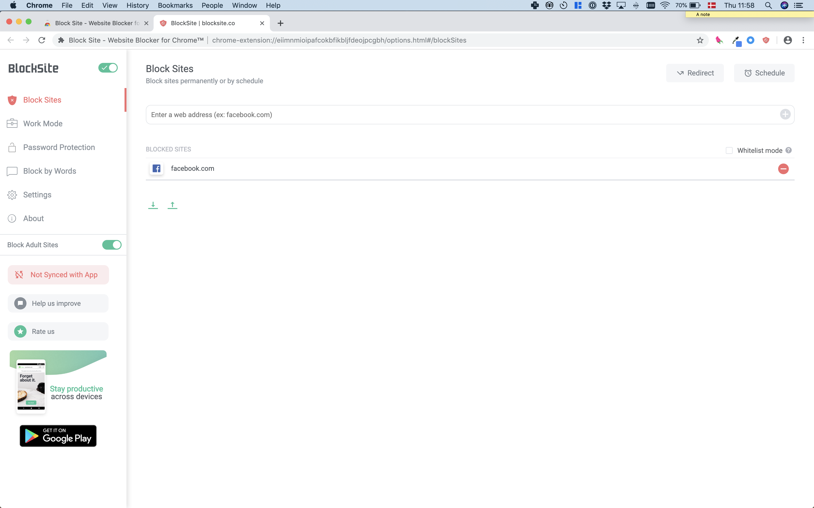
knitr::include_graphics("figures/chrome_block_result.png")
```

On **Safari**, try [Roadblock](https://safari-extensions.apple.com/details/?id=com.obiedcorner.Roadblock-WE58FS6Q6B):

```{r, out.width="50%", fig.align='center'}
knitr::include_graphics("figures/roadblock.png")
```

On **Firefox**, try [Impulse Blocker](https://addons.mozilla.org/en-US/firefox/addon/impulse-blocker/?src=search):

```{r, out.width="50%", fig.align='center'}
knitr::include_graphics("figures/impulse_control.png")
```

You can find many others by searching through the extensions store for the web browser you use:

- [Safari Extensions](https://safari-extensions.apple.com)
- [Chrome Extensions](https://chrome.google.com/webstore/category/extensions?hl=en)
- [Firefox Add-Ons](https://addons.mozilla.org/en-GB/firefox/)

### Smartphone
On **Android**, one of the most popular app blockers is [Stay Focused](https://play.google.com/store/apps/details?id=com.stayfocused&hl=en_GB):

```{r, out.width="45%"}
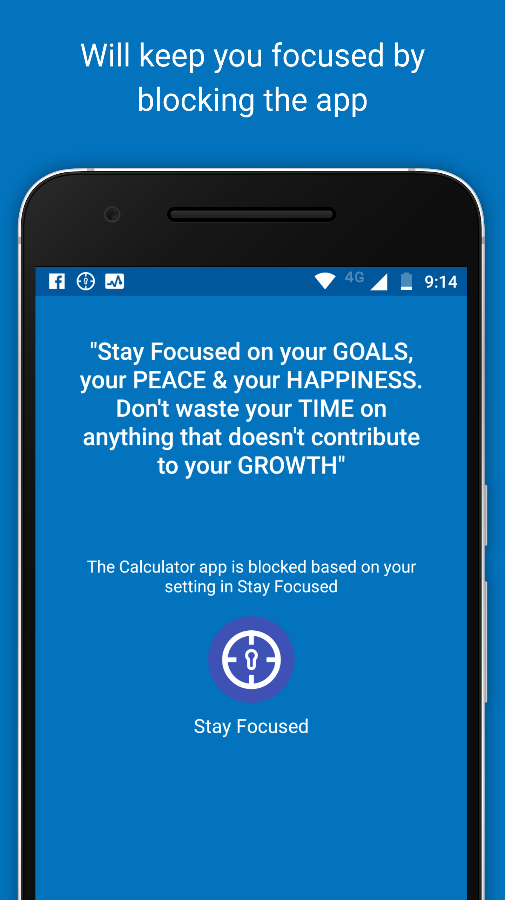
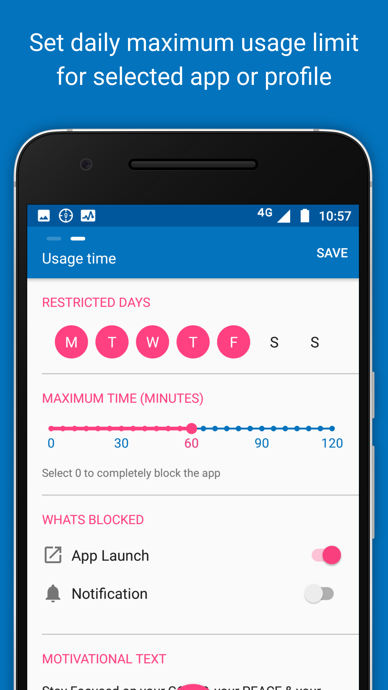
#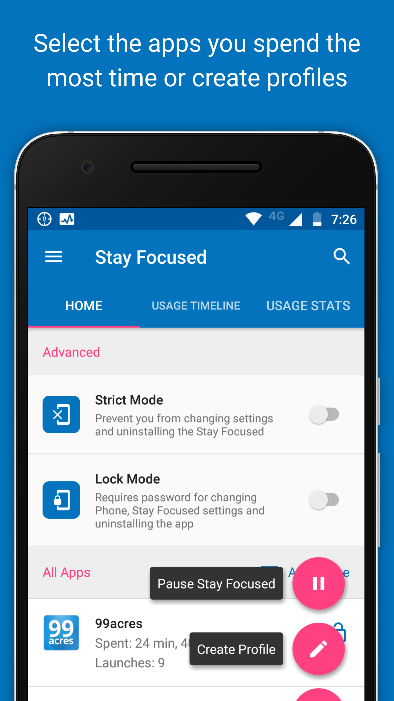
```

On **iOS**, use Apple's built-in app [Screen Time](https://support.apple.com/en-gb/HT208982) to block your own access to particular apps.

You can do so in two ways:

- *Restrict category of apps*: Go to **Settings -> Screen Time -> App Limits**. iOS will ask you to pick an entire category of apps to apply a time restriction to. 
- *Restrict specific app*: Go to **Settings -> Screen Time**. Find the app in the list of “Most Used” and tap it. You’ll see an “add limit” option near the bottom of the following screen.


## Remove features
You can also use browser extensions to remove features of websites you find distracting.

### Facebook
#### Removing the newsfeed
On Chrome, try [News Feed Eradicator](https://chrome.google.com/webstore/detail/news-feed-eradicator-for/fjcldmjmjhkklehbacihaiopjklihlgg).

```{r, out.width="80%", fig.align='center'}
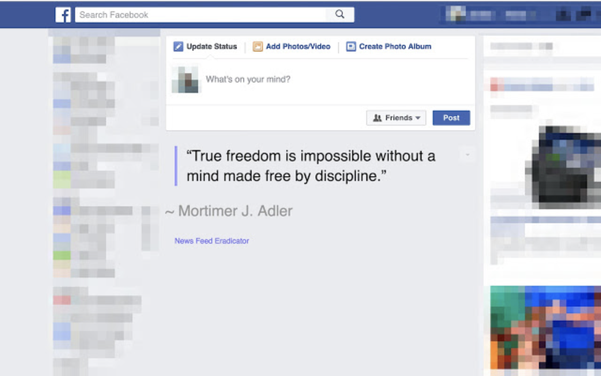
```

On Safari, try [Newsfeed Blocker for Facebook](https://safari-extensions.apple.com/details/?id=com.nolandey.bundleid-A5P7J5U845).

On iPhones, try [Feedless](https://apps.apple.com/us/app/feedless-newsfeed-blocker/id1339509325) to remove Facebook's newsfeed in Safari (this extension can also block the feed in Instagram and Twitter):

```{r, out.width="80%", fig.align='center'}
knitr::include_graphics("figures/feedless.png")
```


#### Removing numerical metrics
You can also use extensions to remove **numerical metrics** on Facebook:

```{r, out.width="80%", fig.align='center'}
knitr::include_graphics("figures/fb-demetricator.jpg")
```

Find installation instructions for the **Facebook Demetricator** [here](https://bengrosser.com/projects/facebook-demetricator/install/).


### YouTube
On **Chrome**, remove recommended videos from YouTube with the extension [Remove YouTube Recommended Videos](https://chrome.google.com/webstore/detail/remove-youtube-recommende/khncfooichmfjbepaaaebmommgaepoid):

```{r, out.width="80%", fig.align='center'}
knitr::include_graphics("figures/chrome_youtube.jpg")
```


On **Safari**, use the [Distraction Blocker for YouTube](https://safari-extensions.apple.com/details/?id=com.robertjeffs.distractionblockerforyoutube-W9AT75TA27)):

```{r, out.width="80%", fig.align='center'}
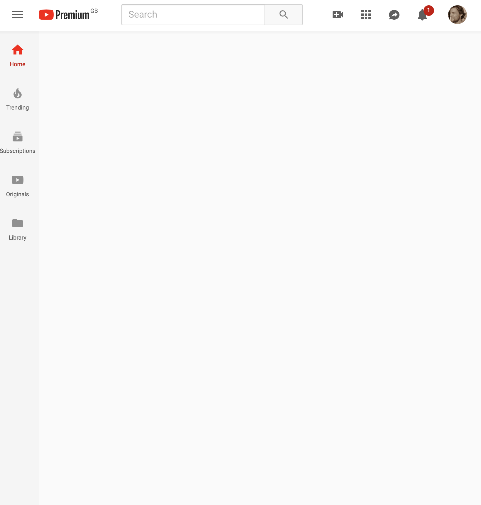
```

On **Firefox**, use [Remove Youtube's Suggestions](https://addons.mozilla.org/en-US/firefox/addon/remove-youtube-s-suggestions/):

```{r, out.width="80%", fig.align='center'}
knitr::include_graphics("figures/firefox_youtube.png")
```


### Gmail
If you use Gmail in a browser, the **Chrome** extension [Inbox When Ready](https://chrome.google.com/webstore/detail/inbox-when-ready-for-gmai/cdedhgmbfjhobfnphaoihdfmnjidcpim?hl=gb) hides your inbox by default, until you deliberately click that you wish to see it:

```{r, out.width="80%", fig.align='center'}
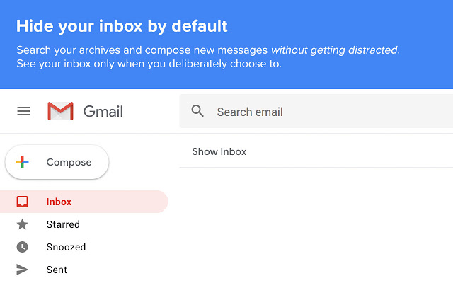
```

For **Firefox**, the extension [Gmail Hide](https://addons.mozilla.org/en-US/firefox/addon/gmail-hide/?src=search) does the same thing:

```{r, out.width="80%", fig.align='center'}
knitr::include_graphics("figures/firefox_gmail.png")
```


### Anything
On **Chrome**, the extension [Click to Remove Element](https://chrome.google.com/webstore/detail/click-to-remove-element/jcgpghgjhhahcefnfpbncdmhhddedhnk?hl=gb) allows you to remove elements from any website with a single click:

```{r, out.width="80%"}
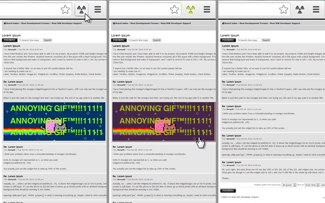
```

On **Firefox**, the extension [Remove HTML Elements](https://addons.mozilla.org/en-US/firefox/addon/remove-html-elements/?src=search) does the same thing.


## Minimal writing tools
When you try to focus on writing, consider getting all distractions out of the way.

### Laptop
If you use **Google Docs** there are browser extensions to make the interface super minimalistic.

On **Chrome**, try [Distraction Free Mode for Google Docs](https://chrome.google.com/webstore/detail/distraction-free-mode-for/blmejkgbnceohgjfnoiegdlbfkmpkeha).

This extension is also available for [**Firefox**](https://addons.mozilla.org/en-US/firefox/addon/distraction-free-google-docs/) and [**Safari**](https://safari-extensions.apple.com/details/?id=com.kallepersson.distractionfree-BBWY83BGU8):

```{r, out.width="80%", fig.align='center'}
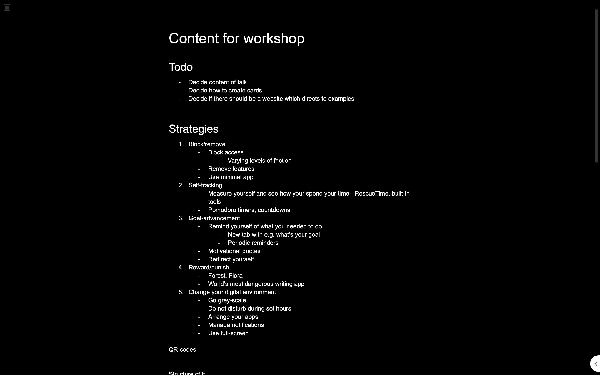
```

<br>


**Microsoft Word** also includes a minimalistic 'Focus' mode:

```{r, out.width="50%"}
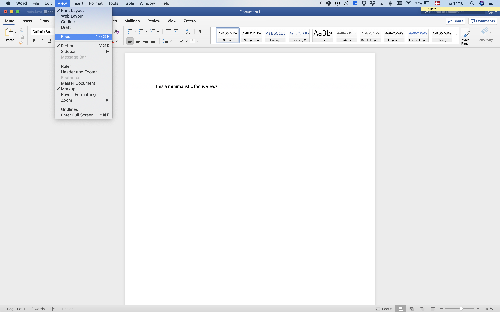
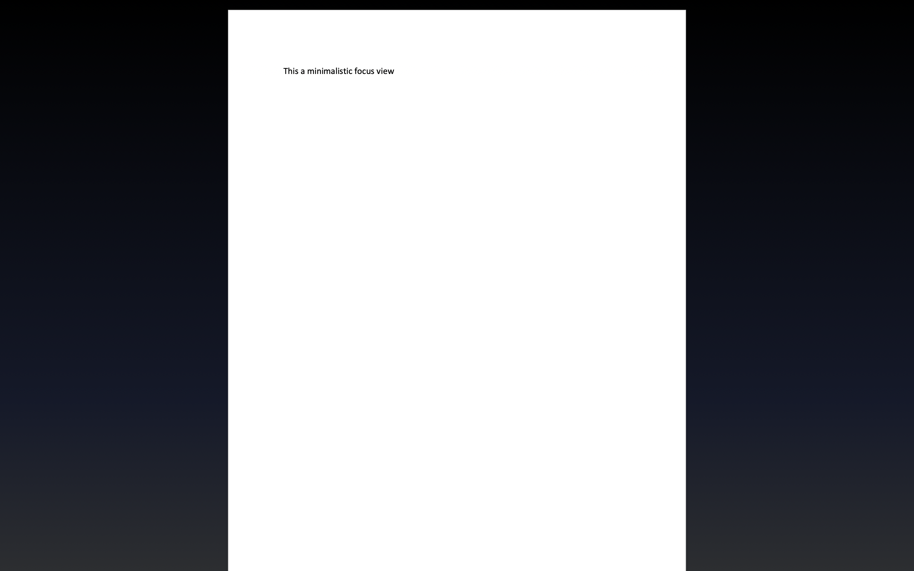
```


### Smartphone
On **Android**, try [JotterPad](https://play.google.com/store/apps/details?id=com.jotterpad.x&hl=en&gl=us):

```{r, out.width="80%", fig.align='center'}
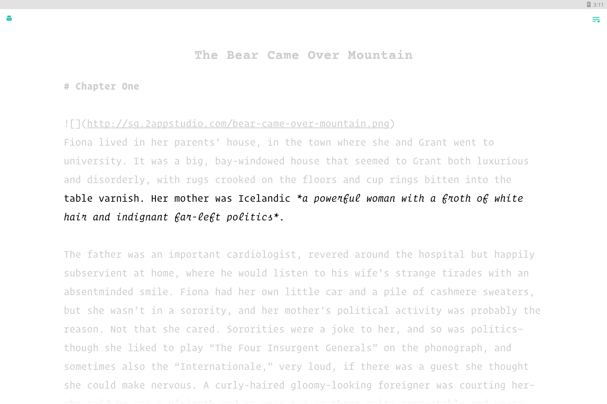
```


## Go monotasking / dumbphone
A few tools can force your devices into 'monotasking' mode. 

### Laptop
[Cold Turkey Writer](https://getcoldturkey.com/writer/) allows you to turn your laptop into a typewriter until you've typed a specific number of words, or for a specific length of time:

```{r, out.width="80%", fig.align='center'}
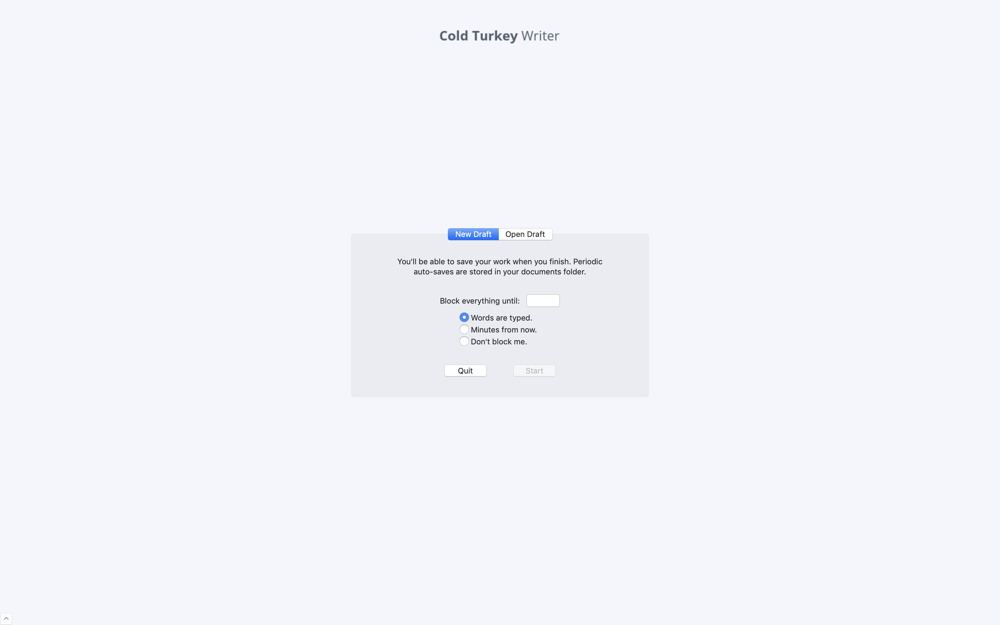
```

### Smartphone
On Android, simulate a similar situation with the app [Dumbphone](https://play.google.com/store/apps/details?id=bg.bozho.dumbphone&hl=en&gl=us):

```{r, out.width="60%", fig.align='center'}
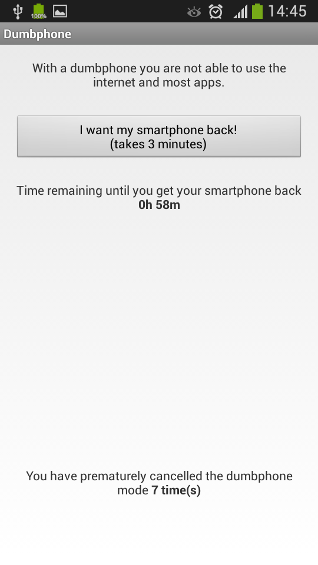
```

<br> 

On iOS, get the same effect using [Screen Time](https://support.apple.com/en-gb/HT208982)'s 'Downtime' feature.
When 'Downtime' is scheduled, only phone calls and apps that you choose to allow are available:

```{r, out.width="40%"}
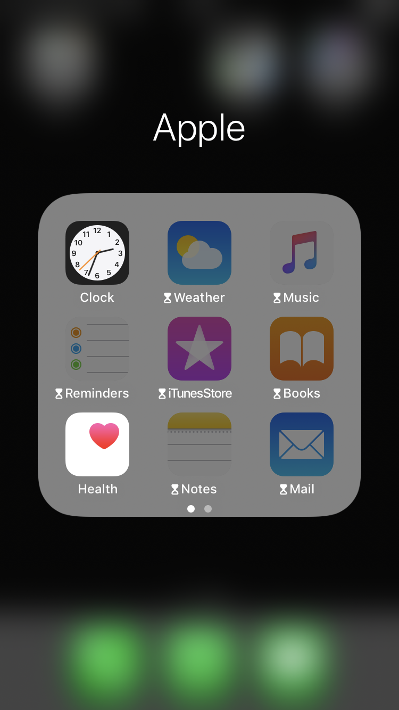
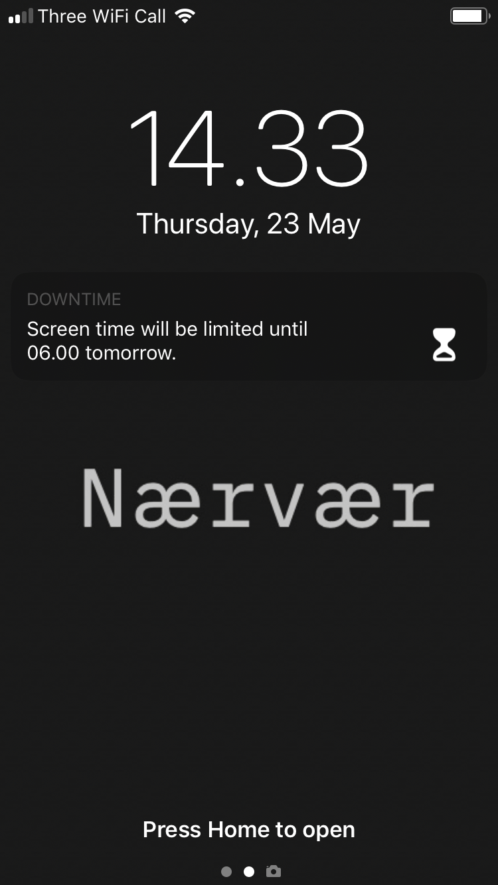
```
