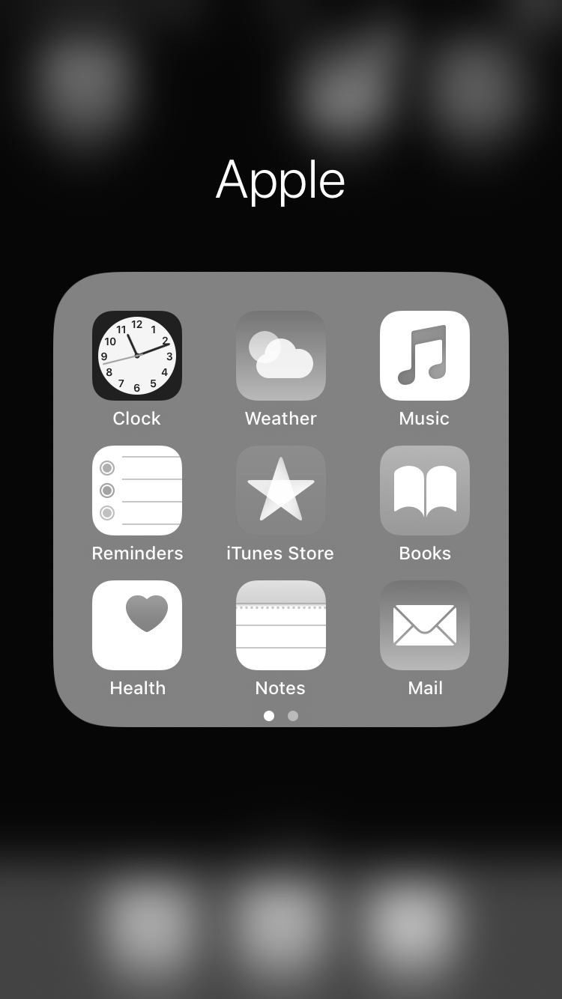
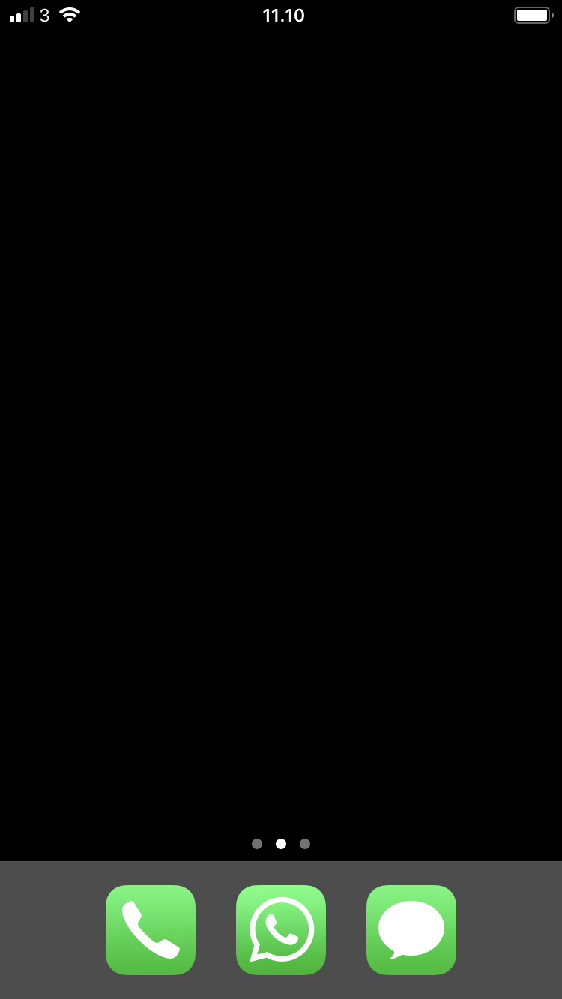
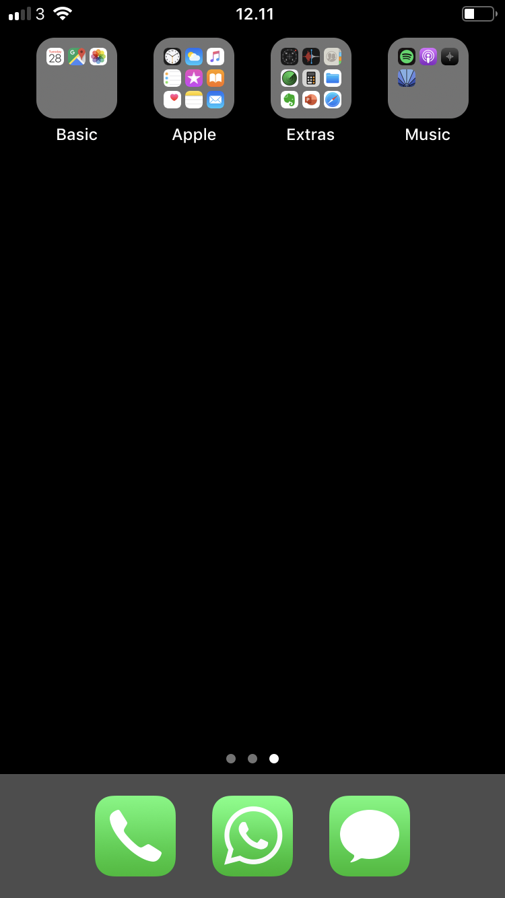
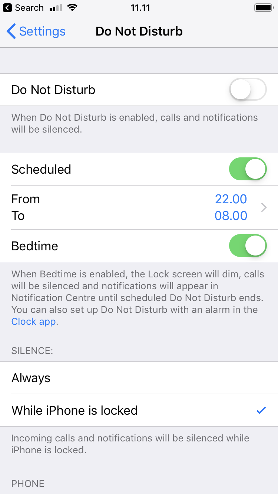
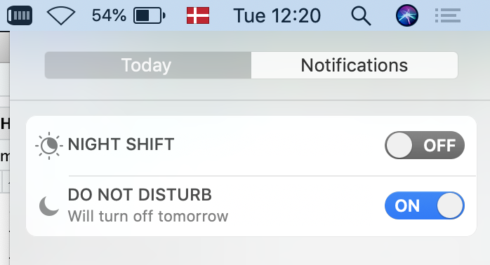
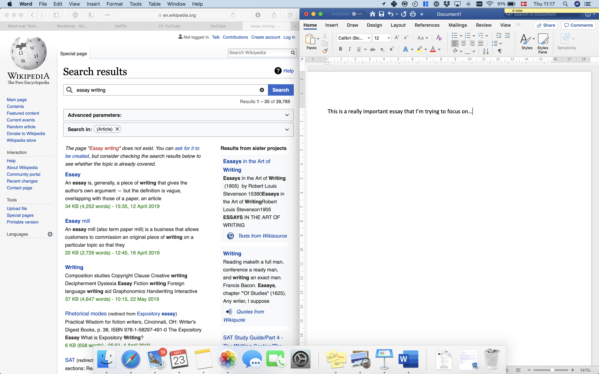
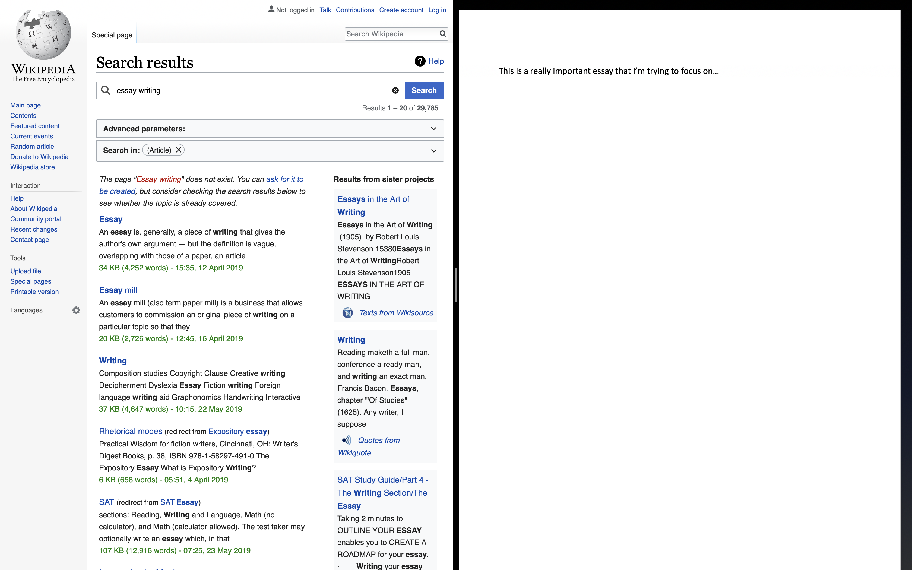

```{r setup, include=FALSE}
knitr::opts_chunk$set(echo = FALSE)
library(tidyverse)
library(knitr)
```


# Change your digital environment {.tabset}
## Go grey-scale (smartphone)
A simple way to make your smartphone less distracting is to turn it greyscale when you do not need color.

```{r, out.width="40%", fig.align='center'}

```

On iPhone, set a triple-tap on the Home button to toggle grey scale on and off:

- **Settings > Accessibility > Accessibility Shortcut > Colour Filters**

Newer versions of the Android operating system may include a gray scale toggle in your phone's quick settings.

## Arrange your apps (smartphone)
Arrange your apps so that the home screen is minimalistic and simple, and so that the apps you'd like to use less often require a bit more effort to reach.

For example, limit your first page of apps to only apps you use for quick in-and-out tasks - move the rest of your apps, especially mindless choices, off the first page and into folders.

```{r, out.width="45%", fig.align='center'}


```

## Do not disturb during set hours
Schedule do not disturb, so that during certain hours (e.g. 9pm to 8am) only calls from your favorite contacts go through directly.

```{r, out.width="40%", fig.align='center'}

```

<br>

*Wind Down* on newer versions of Android also provides this feature, as well as the ability to automatically turn your phone greyscale when getting ready for bed.

## Manage notifications
Be ruthless about which apps you give the ability to send you notifications.

On **iOS**, go to **Settings > Notifications** and carefully consider which apps should be allowed to disturb you.

On a **Mac**, newer operating systems also include a Do Not Disturb mode, for when you need to focus without having popups about incoming email etc.:

```{r, out.width="40%", fig.align='center'}

```

## Use full-screen (laptop)
On a laptop, try limiting the amount of information available to you to what you actually need for your task.

On **Mac**, one way to do this is by using full screen mode to e.g. put two tools you need side by side:

```{r, out.width="80%", fig.align='center', fig.cap="Rather than this..."}

```

```{r, out.width="80%", fig.align='center', fig.cap="... try this"}

```

