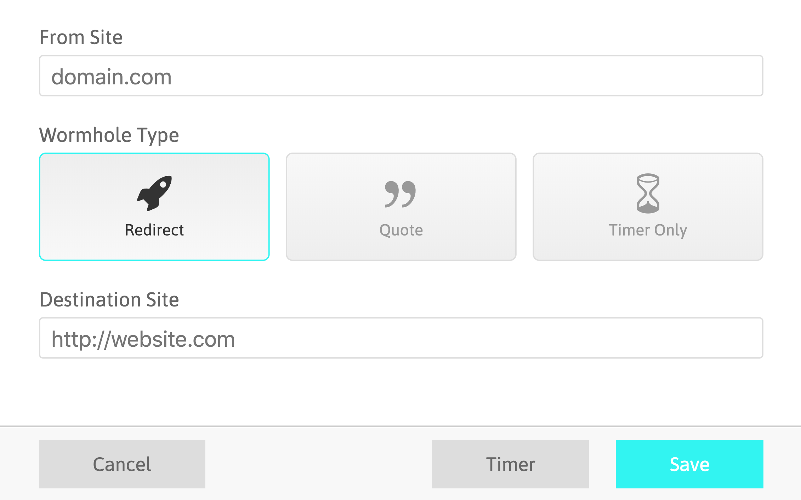
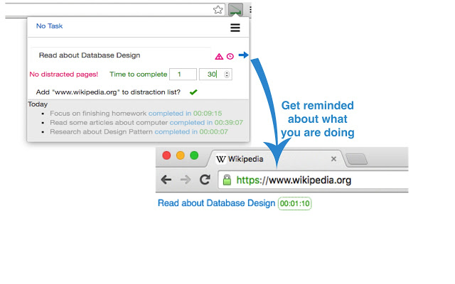

---
output:
  html_document:
    theme: cosmo
    self_contained: false
    number_sections: false
    css: style.css
---


```{r setup, include=FALSE}
knitr::opts_chunk$set(echo = FALSE)
library(tidyverse)
library(knitr)
```

# Advance your goals {.tabset}
## Use new tabs to remind you of your goals
On **laptop**, use new tabs to remind you of what you need to do.

For example, the Chrome extension [Focus](https://chrome.google.com/webstore/detail/focus/paipcheolflniajdfeglfpddafcklepg?hl=gb) turns new tabs into a todo-list:

```{r, out.width="80%", fig.align='center'}
knitr::include_graphics("figures/focus_tab.png")
```

This extension also lets you block distracting websites while you focus on a specific task.

Search through the browser extension stores for a similar extension which might be useful to you:

- [Safari Extensions](https://safari-extensions.apple.com)
- [Chrome Extensions](https://chrome.google.com/webstore/category/extensions?hl=en)
- [Firefox Add-Ons](https://addons.mozilla.org/en-GB/firefox/)


## Motivational quotes
On **laptop**, use new tabs to remind you of the important things in life.

For example, use the Chrome extension [Daily Motivation](https://chrome.google.com/webstore/detail/daily-motivation-motivati/nonnkklkpbokmppgochfdamhihaijdin?hl=gb) to put motivational quotes on new tabs:

```{r, out.width="80%", fig.align='center'}
knitr::include_graphics("figures/daily_motivation.png")
```

Search through the browser extension stores for similar extensions for your browser:

- [Safari Extensions](https://safari-extensions.apple.com)
- [Chrome Extensions](https://chrome.google.com/webstore/category/extensions?hl=en)
- [Firefox Add-Ons](https://addons.mozilla.org/en-GB/firefox/)


## Replace Facebook's newsfeed with a todo-list
On **laptop**, you can replace Facebook's newsfeed with other content.

For example, use the Chrome extension [Todobook](https://chrome.google.com/webstore/detail/todobook/ihbejplhkeifejcpijadinaicidddbde?hl=gb) to replace Facebook's newsfeed with a todo list.

```{r, out.width="80%", fig.align='center'}
knitr::include_graphics("figures/todobook.png")
```

Search through the browser extension stores for similar extensions for your browser:

- [Safari Extensions](https://safari-extensions.apple.com)
- [Chrome Extensions](https://chrome.google.com/webstore/category/extensions?hl=en)
- [Firefox Add-Ons](https://addons.mozilla.org/en-GB/firefox/)

## Automatically redirect yourself away from distraction 
On **laptop**, automatically redirect yourself away from distracting websites when you need to focus.

For example, use the Chrome extension [Timewarp](https://chrome.google.com/webstore/detail/timewarp/mmmhadpnjmokjbmgamifipkjddhlfkhi?hl=gb):

```{r, out.width="80%", fig.align='center'}

```

Search through the browser extension stores for similar extensions for your browser:

- [Safari Extensions](https://safari-extensions.apple.com)
- [Chrome Extensions](https://chrome.google.com/webstore/category/extensions?hl=en)
- [Firefox Add-Ons](https://addons.mozilla.org/en-GB/firefox/)


## Periodic reminders
Be mindful of what you're supposed to be doing.

For example, use the Chrome extension [Gen4](https://chrome.google.com/webstore/detail/gen4/pjkdlacnjfgkdbpojjfalmehngmlegnd/related?hl=gb) to get periodic reminders of what you're supposed to be doing while browsing the web:

```{r, out.width="50%"}

knitr::include_graphics("figures/gen4-2.jpg")
```
