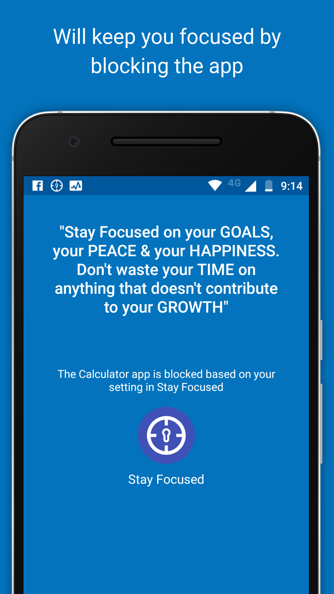
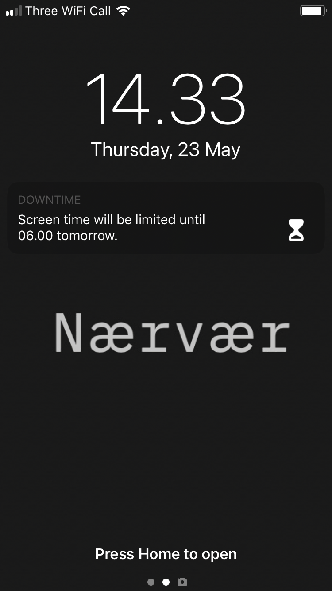

```{r setup, include=FALSE}
knitr::opts_chunk$set(echo = FALSE)
library(tidyverse)
library(knitr)

```

Welcome to the accompanying website to the **Re**ducing **D**igital **D**istraction (ReDD) workshop.

Here, you will find a bit of further detail about the tools and strategies listed on the cards handed out in the workshop.

You can scroll through a large number of tools here: [tinyurl.com/digital-selfcontrol](https://docs.google.com/spreadsheets/d/1BVBCBOZQY_K7qYmDiSIail07F6D1iDG1OkoFyazb5Y4/edit#gid=777024457).

# Block/Remove distractions
## Block access
If particular websites or apps distract you, try blocking your own access to them for some time or after a certain amount of time has passed.

### Laptop
Many browser extensions allow you to block distracting websites. 
Discover these by searching through the web stores for extensions for the web browser you use:
- [Safari Extensions](https://safari-extensions.apple.com)
- [Chrome Extensions](https://chrome.google.com/webstore/category/extensions?hl=en)
- [Firefox Add-Ons](https://addons.mozilla.org/en-GB/firefox/)

The most popular website blocker for Chrome is [Block Site - Website Blocker for Chrome™](https://chrome.google.com/webstore/detail/block-site-website-blocke/eiimnmioipafcokbfikbljfdeojpcgbh/related?hl=en):
```{r}
knitr::include_graphics("figures/chrome_block_setup.png")
knitr::include_graphics("figures/chrome_block_result.png")
```

### Smartphone
On Android, the most popular app blocker is [Stay Focused](https://play.google.com/store/apps/details?id=com.stayfocused&hl=en_GB):

```{r, out.width="50%"}

knitr::include_graphics("figures/stay_focused_limit.png")
#knitr::include_graphics("figures/stay_focused_options.png")
```

On iPhones, you can use Apple's built-in app [Screen Time](https://support.apple.com/en-gb/HT208982) to block your own access to particular apps.

Go to Settings -> Screen Time -> App Limits

## Remove features
On laptop, you can use browser extensions to remove particular features of websites that you find distracting.

For example, you can use extensions to remove Facebook's newsfeed (e.g. with Chrome's [News Feed Eradicator](https://chrome.google.com/webstore/detail/news-feed-eradicator-for/fjcldmjmjhkklehbacihaiopjklihlgg)), or remove recommended videos from YouTube (e.g. with Safari's [Distraction Blocker for YouTube](https://safari-extensions.apple.com/details/?id=com.robertjeffs.distractionblockerforyoutube-W9AT75TA27)):

```{r, out.width="50%"}
knitr::include_graphics("figures/fb_newsfeed.png")
knitr::include_graphics("figures/youtube_minimal.png")
```

The Chrome extension [Click to Remove Element](https://chrome.google.com/webstore/detail/click-to-remove-element/jcgpghgjhhahcefnfpbncdmhhddedhnk?hl=gb) allows you to, with a simple click, remove particular elements from any website:

```{r}
knitr::include_graphics("figures/remove_element.jpg")
```

Or, if you use Gmail in a browser, how about [Inbox When Ready](https://chrome.google.com/webstore/detail/inbox-when-ready-for-gmai/cdedhgmbfjhobfnphaoihdfmnjidcpim?hl=gb), which hides your inbox by default, until you deliberately click that you wish to see it? 

```{r}
knitr::include_graphics("figures/inbox_ready.jpg")
```

Search through the browser extension stores for a similar extension which might be useful to you:
- [Safari Extensions](https://safari-extensions.apple.com)
- [Chrome Extensions](https://chrome.google.com/webstore/category/extensions?hl=en)
- [Firefox Add-Ons](https://addons.mozilla.org/en-GB/firefox/)

## Minimal writing tools
When you try to focus on writing, consider getting all distractions out of the way.

For smartphones, there are dedicated minimalistic writing tools such as [JotterPad](https://play.google.com/store/apps/details?id=com.jotterpad.x&hl=en&gl=us):
```{r}
knitr::include_graphics("figures/jotterpad.png")
```

If you use Google Docs on your laptop, there are browser extensions that can make the interface super minimalistic, such as [DistractionFree for Safari](https://safari-extensions.apple.com/details/?id=com.kallepersson.distractionfree-BBWY83BGU8):

```{r}
knitr::include_graphics("figures/google_docs.png")
```

And even Microsoft Word now includes a minimalistic 'Focus' mode:

```{r, out.width="50%"}
knitr::include_graphics("figures/word_focus1.png")
knitr::include_graphics("figures/word_focus2.png")
```


## Go monotasking / dumbphone
A few tools can force your devices into 'monotasking' mode. 

### Laptop
[Cold Turkey Writer](https://getcoldturkey.com/writer/) allows you to turn your laptop into a typewriter until you've typed a specific number of words or for a specific length of time:
```{r}
knitr::include_graphics("figures/cold_turkey.png")
```

### Smartphone
On Android, you can simulate a similar situation with the app [Dumbphone](https://play.google.com/store/apps/details?id=bg.bozho.dumbphone&hl=en&gl=us):
```{r}
knitr::include_graphics("figures/dumbphone.png")
```

On iPhones, you can get the same effect by using the [Screen Time](https://support.apple.com/en-gb/HT208982) app's 'Downtime' feature.
When 'Downtime' is scheduled, only phone calls and apps that you choose to allow are available:

```{r, out.width="50%"}
knitr::include_graphics("figures/downtime1.png")

```


# Self-tracking
## Measure yourself and see how your spend your time - RescueTime, built-in tools
## Pomodoro timers, countdowns

# Goal-advancement
## Remind yourself of what you needed to do
## New tab with e.g. what’s your goal
## Periodic reminders
## Motivational quotes
## Redirect yourself

# Reward/punish
## Forest, Flora
## World’s most dangerous writing app

# Change your digital environment
## Go grey-scale
## Do not disturb during set hours
## Arrange your apps
## Manage notifications
## Use full-screen
