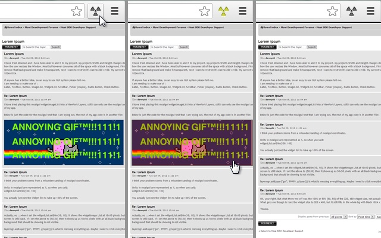
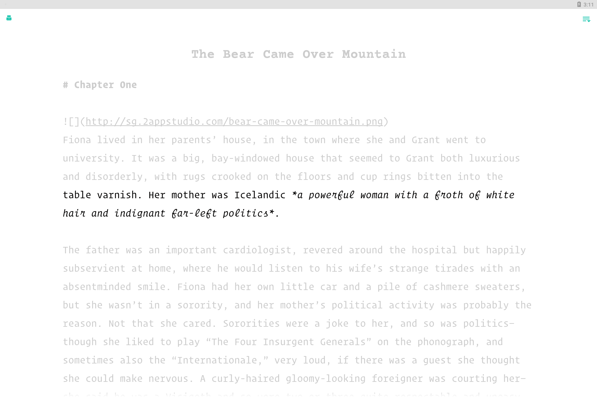
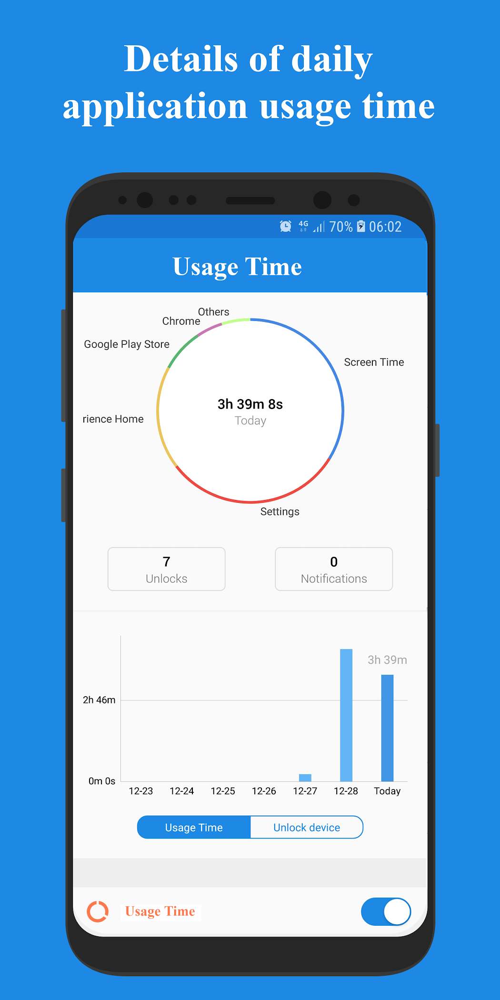
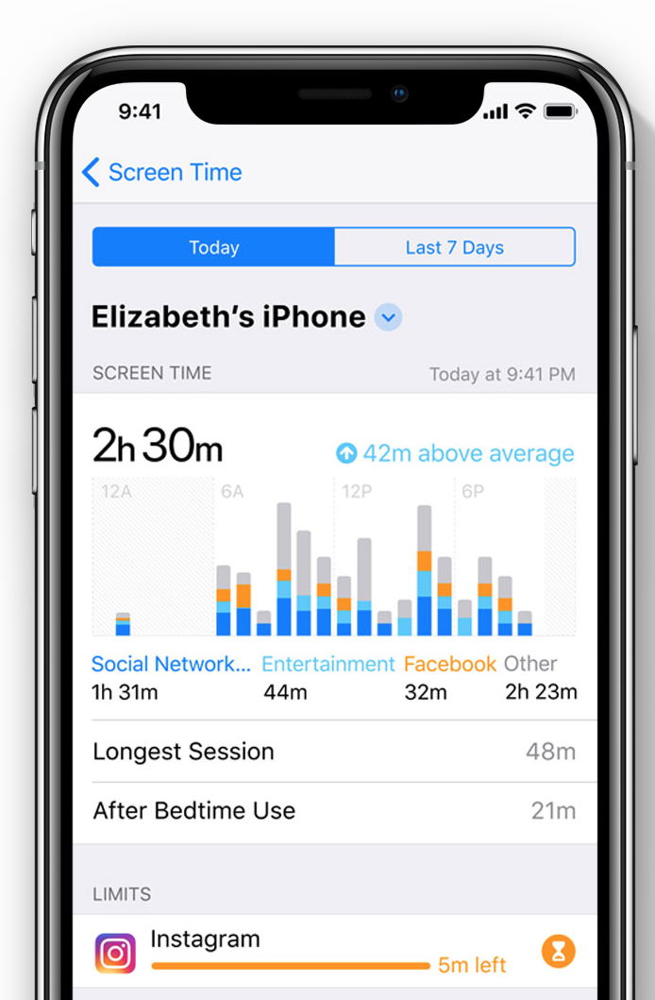
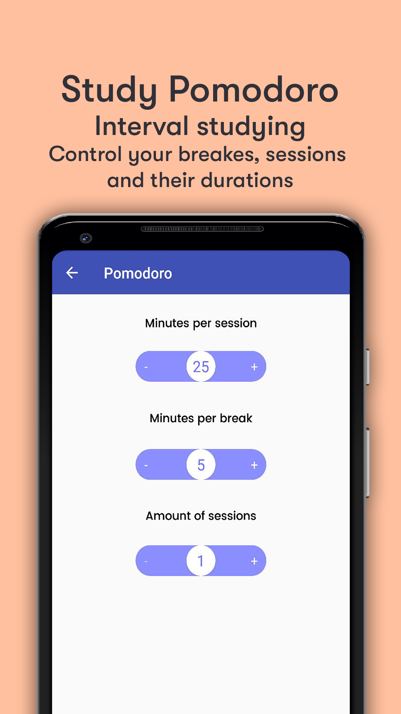
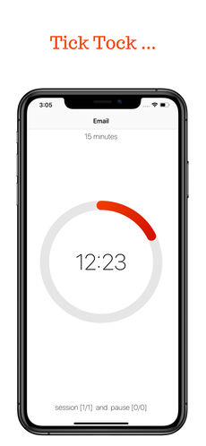

```{r setup, include=FALSE}
knitr::opts_chunk$set(echo = FALSE)
library(tidyverse)
library(knitr)

```

Welcome to the accompanying website to the **Re**ducing **D**igital **D**istraction (ReDD) workshop.

Here, you will find a bit of further detail about the tools and strategies listed on the cards handed out in the workshop.

You can scroll through a large number of tools here: [tinyurl.com/digital-selfcontrol](https://docs.google.com/spreadsheets/d/1BVBCBOZQY_K7qYmDiSIail07F6D1iDG1OkoFyazb5Y4/edit#gid=777024457).

# Block or remove distractions
## Block access
If particular websites or apps distract you, try blocking your own access to them for some time or after a certain amount of time has passed.

### Laptop
Many browser extensions allow you to block distracting websites. 
Discover these by searching through the web stores for extensions for the web browser you use:
- [Safari Extensions](https://safari-extensions.apple.com)
- [Chrome Extensions](https://chrome.google.com/webstore/category/extensions?hl=en)
- [Firefox Add-Ons](https://addons.mozilla.org/en-GB/firefox/)

The most popular website blocker for Chrome is [Block Site - Website Blocker for Chrome™](https://chrome.google.com/webstore/detail/block-site-website-blocke/eiimnmioipafcokbfikbljfdeojpcgbh/related?hl=en):
```{r, out.width="50%"}
knitr::include_graphics("figures/chrome_block_setup.png")
knitr::include_graphics("figures/chrome_block_result.png")
```

### Smartphone
On Android, the most popular app blocker is [Stay Focused](https://play.google.com/store/apps/details?id=com.stayfocused&hl=en_GB):

```{r, out.width="50%"}
knitr::include_graphics("figures/stay_focused_block.png")
knitr::include_graphics("figures/stay_focused_limit.png")
#knitr::include_graphics("figures/stay_focused_options.png")
```

On iPhones, you can use Apple's built-in app [Screen Time](https://support.apple.com/en-gb/HT208982) to block your own access to particular apps.

Go to Settings -> Screen Time -> App Limits

## Remove features
On laptop, you can use browser extensions to remove particular features of websites that you find distracting.

For example, you can use extensions to remove Facebook's newsfeed (e.g. with Chrome's [News Feed Eradicator](https://chrome.google.com/webstore/detail/news-feed-eradicator-for/fjcldmjmjhkklehbacihaiopjklihlgg)), or remove recommended videos from YouTube (e.g. with Safari's [Distraction Blocker for YouTube](https://safari-extensions.apple.com/details/?id=com.robertjeffs.distractionblockerforyoutube-W9AT75TA27)):

```{r, out.width="50%"}
knitr::include_graphics("figures/fb_newsfeed.png")
knitr::include_graphics("figures/youtube_minimal.png")
```

The Chrome extension [Click to Remove Element](https://chrome.google.com/webstore/detail/click-to-remove-element/jcgpghgjhhahcefnfpbncdmhhddedhnk?hl=gb) allows you to, with a simple click, remove particular elements from any website:

```{r}

```

Or, if you use Gmail in a browser, how about [Inbox When Ready](https://chrome.google.com/webstore/detail/inbox-when-ready-for-gmai/cdedhgmbfjhobfnphaoihdfmnjidcpim?hl=gb), which hides your inbox by default, until you deliberately click that you wish to see it? 

```{r}
knitr::include_graphics("figures/inbox_ready.jpg")
```

Search through the browser extension stores for a similar extension which might be useful to you:
- [Safari Extensions](https://safari-extensions.apple.com)
- [Chrome Extensions](https://chrome.google.com/webstore/category/extensions?hl=en)
- [Firefox Add-Ons](https://addons.mozilla.org/en-GB/firefox/)

## Minimal writing tools
When you try to focus on writing, consider getting all distractions out of the way.

For smartphones, there are dedicated minimalistic writing tools such as [JotterPad](https://play.google.com/store/apps/details?id=com.jotterpad.x&hl=en&gl=us):
```{r}

```

If you use Google Docs on your laptop, there are browser extensions that can make the interface super minimalistic, such as [DistractionFree for Safari](https://safari-extensions.apple.com/details/?id=com.kallepersson.distractionfree-BBWY83BGU8):

```{r}
knitr::include_graphics("figures/google_docs.png")
```

And even Microsoft Word now includes a minimalistic 'Focus' mode:

```{r, out.width="50%"}
knitr::include_graphics("figures/word_focus1.png")
knitr::include_graphics("figures/word_focus2.png")
```


## Go monotasking / dumbphone
A few tools can force your devices into 'monotasking' mode. 

### Laptop
[Cold Turkey Writer](https://getcoldturkey.com/writer/) allows you to turn your laptop into a typewriter until you've typed a specific number of words or for a specific length of time:
```{r}
knitr::include_graphics("figures/cold_turkey.png")
```

### Smartphone
On Android, you can simulate a similar situation with the app [Dumbphone](https://play.google.com/store/apps/details?id=bg.bozho.dumbphone&hl=en&gl=us):
```{r}
knitr::include_graphics("figures/dumbphone.png")
```

On iPhones, you can get the same effect by using the [Screen Time](https://support.apple.com/en-gb/HT208982) app's 'Downtime' feature.
When 'Downtime' is scheduled, only phone calls and apps that you choose to allow are available:

```{r, out.width="50%"}
knitr::include_graphics("figures/downtime1.png")
knitr::include_graphics("figures/downtime2.png")
```


# Track yourself
## See how your spend your time
Various tools are available to see how your spend time on your devices, and compare it to your goals.

On **laptop**, one of the most popular tools is [RescueTime](https://www.rescuetime.com): 

```{r}
knitr::include_graphics("figures/rescue_time.png")
```

### Android
On **Android**, apps such as [Usage Time](https://play.google.com/store/apps/details?id=com.agooday.screentime&hl=en&gl=us) provide the same functionality:

```{r}

```

Google has also begun to provide the same functionality via their [Digital Wellbeing](https://play.google.com/store/apps/details?id=com.google.android.apps.wellbeing&hl=en_GB) app which comes pre-installed on many newer devices:
```{r}
knitr::include_graphics("figures/digi_wellbeing.jpeg")
```

### iOS
On iOS, Apple's recent app [Screen Time](https://support.apple.com/en-gb/HT208982) provides this ability:
```{r}

```

## Work in bursts with a timer - Pomodoro technique
To keep you on track with what you're momentarily doing, many people track themselves with a countdown timer.
This is often done in adherence to the 'Pomodoro' technique, where you break your work down into intervals, typically 25 minutes in length, separated by short breaks.

### Laptop
Numerous tools exist for implementing this, for example [Be Focused](https://xwavesoft.com/be-focused-pro-for-iphone-ipad-mac-os-x.html):

```{r}
knitr::include_graphics("figures/pomodoro.png")
```

You can also combine this with blocking distracting websites during work intervals, for example with [FocusMe](https://chrome.google.com/webstore/detail/focusme-a-pomodoro-timer/koebbleaefghpjjmghelhjboilcmfpad?hl=gb):

```{r}
knitr::include_graphics("figures/focusme.png")
```

### Android
Apps that implement this functionality include [Its Study Time](https://play.google.com/store/apps/details?id=com.deGans.itsStudyTime&hl=en&gl=us):
```{r}

```

### iOS
On Apple's devices, this is implemented by tools including [Mattie](https://itunes.apple.com/gb/app/sidekick-mattie/id1166327958?mt=8&ign-mpt=uo%3D4):

```{r}

```

# Advance your goals
## Make new tabs remind you of your goals
On **laptop**, make new tabs remind you of what you need to do.

For example, you can use the Chrome extension [Focus](https://chrome.google.com/webstore/detail/focus/paipcheolflniajdfeglfpddafcklepg?hl=gb) to turn new tabs into a todo-list:

```{r}
knitr::include_graphics("figures/focus_tab.png")
```

This extension also lets you block distracting websites while you focus on a specific task.

Search through the browser extension stores for a similar extension which might be useful to you:
- [Safari Extensions](https://safari-extensions.apple.com)
- [Chrome Extensions](https://chrome.google.com/webstore/category/extensions?hl=en)
- [Firefox Add-Ons](https://addons.mozilla.org/en-GB/firefox/)


## Motivational quotes
On **laptop**, use new tabs to remind of what's important in life.

For example, use the Chrome extension [Daily Motivation](https://chrome.google.com/webstore/detail/daily-motivation-motivati/nonnkklkpbokmppgochfdamhihaijdin?hl=gb) to replace the content of new tabs with motivational quotes:

```{r}
knitr::include_graphics("figures/daily_motivation.png")
```

Search through the browser extension stores for similar extensions for your browser:
- [Safari Extensions](https://safari-extensions.apple.com)
- [Chrome Extensions](https://chrome.google.com/webstore/category/extensions?hl=en)
- [Firefox Add-Ons](https://addons.mozilla.org/en-GB/firefox/)


## Replace Facebook's newsfeed with a todo-list

On **laptop**, replace Facebook's newsfeed with reminders of what you need to do.

For example, use the Chrome extension [Todobook](https://chrome.google.com/webstore/detail/todobook/ihbejplhkeifejcpijadinaicidddbde?hl=gb) to replace Facebook's newsfeed with a todo list.

```{r}
knitr::include_graphics("figures/todobook.png")
```

Search through the browser extension stores for similar extensions for your browser:
- [Safari Extensions](https://safari-extensions.apple.com)
- [Chrome Extensions](https://chrome.google.com/webstore/category/extensions?hl=en)
- [Firefox Add-Ons](https://addons.mozilla.org/en-GB/firefox/)

## Automatically redirect yourself away from distraction 
On **laptop**, automatically redirect yourself away from distracting websites when you need to focus.

For example, use the Chrome extension [Timewarp](https://chrome.google.com/webstore/detail/timewarp/mmmhadpnjmokjbmgamifipkjddhlfkhi?hl=gb):

```{r}
knitr::include_graphics("figures/timewarp.png")
```

Search through the browser extension stores for similar extensions for your browser:
- [Safari Extensions](https://safari-extensions.apple.com)
- [Chrome Extensions](https://chrome.google.com/webstore/category/extensions?hl=en)
- [Firefox Add-Ons](https://addons.mozilla.org/en-GB/firefox/)


## Periodic reminders
Remind yourself to mindful of what you're doing.

For example, use the Chrome extension [Gen4](https://chrome.google.com/webstore/detail/gen4/pjkdlacnjfgkdbpojjfalmehngmlegnd/related?hl=gb) to get period reminders of what you're supposed to be doing while you're browsing the web:

```{r, out.width="50%"}
knitr::include_graphics("figures/gen4.jpg")
knitr::include_graphics("figures/gen4-2.jpg")
```


# Reward or punish yourself
## Protect a virtual creature by sticking with your intentions
To get a little extra push of motivation to use your devices in the way you intended, you can introduce a little extra reward.

One of the most popular apps is [Forest](https://www.forestapp.cc/) which lets you grow virtual trees during focus sessions, that die if you do not stick with your intention.

```{r, out.width="33%"}
knitr::include_graphics("figures/forest_iphone.png")
knitr::include_graphics("figures/forest_android.png")

```

Forest is available for [iOS](https://itunes.apple.com/app/forest-stay-focused-stop-phubbing/id866450515), [Android](https://play.google.com/store/apps/details?id=cc.forestapp), and as a [Chrome extension](https://chrome.google.com/webstore/detail/forest-stay-focused-be-pr/kjacjjdnoddnpbbcjilcajfhhbdhkpgk).

Other tools include [Feed the Goat (Chrome Extension)](https://docs.google.com/spreadsheets/d/1BVBCBOZQY_K7qYmDiSIail07F6D1iDG1OkoFyazb5Y4/edit#gid=777024457) and [Flora (iOS)](https://itunes.apple.com/us/app/flora-focus-study-pomodoro/id1225155794?mt=8&ign-mpt=uo%3D4):

```{r, out.width="50%"}
knitr::include_graphics("figures/flora.png")
knitr::include_graphics("figures/feed_goat.png")
```

## Writing under pressure
The online tool [The Most Dangerous Writing App](https://www.themostdangerouswritingapp.com) helps you get into the flow of writing by adding pressure:
You set a target word count or duration of time, begin typing, and if you stop typing for more than a few seconds before you hit the goal, all you have typed is deleted!

```{r}
knitr::include_graphics("figures/worlds_dangerous.png")
```

Perfect for simulating the feeling of being so close to a deadline that procrastination is no longer an option.

# Change your digital environment
## Go grey-scale
## Do not disturb during set hours
## Arrange your apps
## Manage notifications
## Use full-screen
