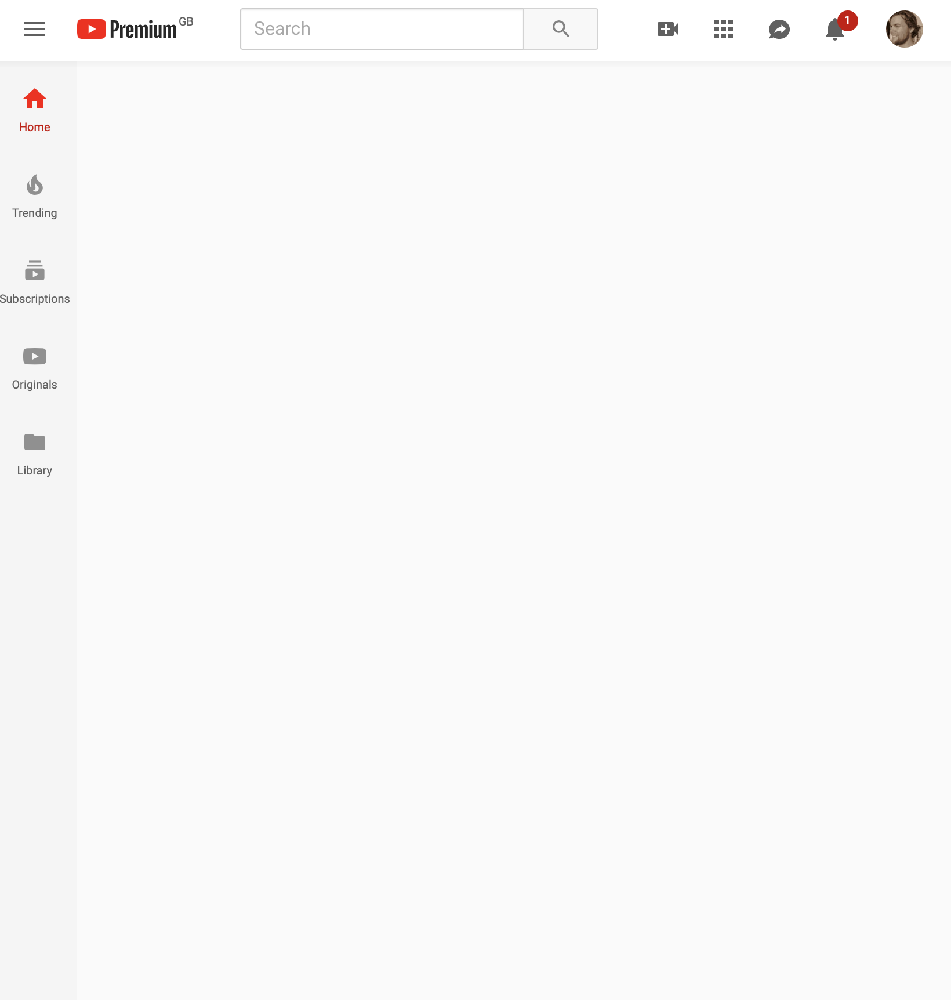

```{r setup, include=FALSE}
knitr::opts_chunk$set(echo = FALSE)
library(tidyverse)
library(knitr)

```

# Reducing Digital Distraction

Welcome to the accompanying website to the **Re**ducing *D*igital *D*istraction (ReDD) workshop.

Here, you will find a bit of further detail about the tools and strategies listed on the cards handed out in the workshop.

# Block/Remove distractions
## Block access
If particular websites or apps distract you, try blocking your own access to them for some time or after a certain amount of time has passed.

### Laptop
Many browser extensions allow you to block distracting websites. 
Discover these by searching through the web stores for extensions for the web browser you use:
- [Safari Extensions](https://safari-extensions.apple.com)
- [Chrome Extensions](https://chrome.google.com/webstore/category/extensions?hl=en)
- [Firefox Add-Ons](https://addons.mozilla.org/en-GB/firefox/)

The most popular website blocker for Chrome is [Block Site - Website Blocker for Chrome™](https://chrome.google.com/webstore/detail/block-site-website-blocke/eiimnmioipafcokbfikbljfdeojpcgbh/related?hl=en):
```{r}
knitr::include_graphics("figures/chrome_block_setup.png")
knitr::include_graphics("figures/chrome_block_result.png")
```

### Smartphone
On Android, the most popular app blocker is [Stay Focused](https://play.google.com/store/apps/details?id=com.stayfocused&hl=en_GB):

```{r}
knitr::include_graphics("figures/stay_focused_block.png")
knitr::include_graphics("figures/stay_focused_limit.png")
#knitr::include_graphics("figures/stay_focused_options.png")
```

On iPhones, you can use Apple's built-in app [Screen Time](https://support.apple.com/en-gb/HT208982) to block your own access to particular apps.

Go to Settings -> Screen Time -> App Limits

## Remove features
On your laptop, you can use browser extensions to remove particular features of websites that you find distracting.

For example, you can use extensions to remove Facebook's newsfeed (e.g. with Chrome's [News Feed Eradicator](https://chrome.google.com/webstore/detail/news-feed-eradicator-for/fjcldmjmjhkklehbacihaiopjklihlgg)), or remove recommended videos from YouTube (e.g. with Safari's [Distraction Blocker for YouTube](https://safari-extensions.apple.com/details/?id=com.robertjeffs.distractionblockerforyoutube-W9AT75TA27)):

```{r}
knitr::include_graphics("figures/fb_newsfeed.png")

```


## Use minimal apps
## Go in monotasking mode
- Cold Turkey writer
- downtime

# Self-tracking
## Measure yourself and see how your spend your time - RescueTime, built-in tools
## Pomodoro timers, countdowns

# Goal-advancement
## Remind yourself of what you needed to do
## New tab with e.g. what’s your goal
## Periodic reminders
## Motivational quotes
## Redirect yourself

# Reward/punish
## Forest, Flora
## World’s most dangerous writing app

# Change your digital environment
## Go grey-scale
## Do not disturb during set hours
## Arrange your apps
## Manage notifications
## Use full-screen
