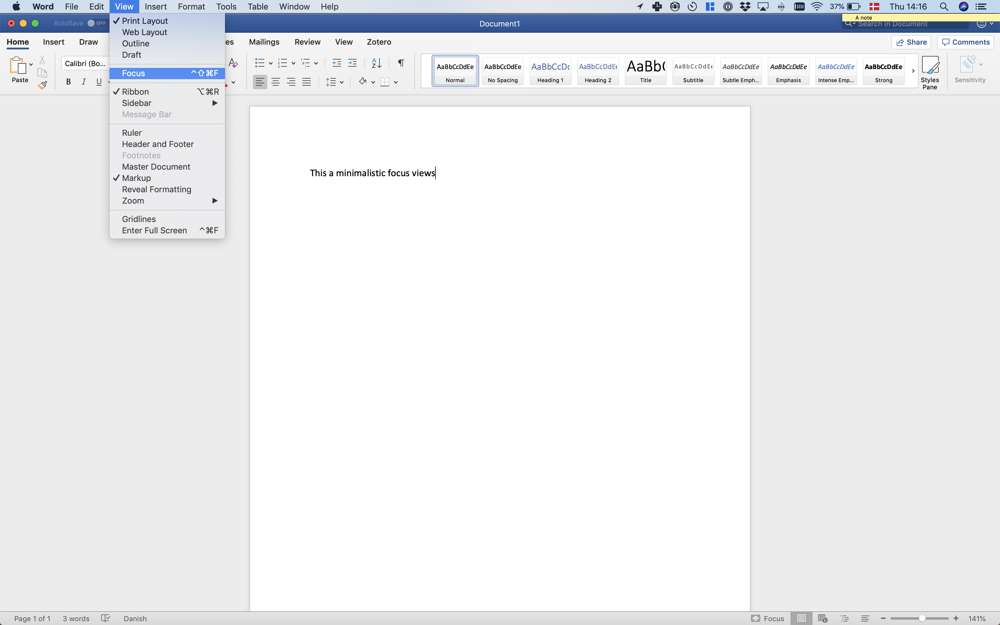
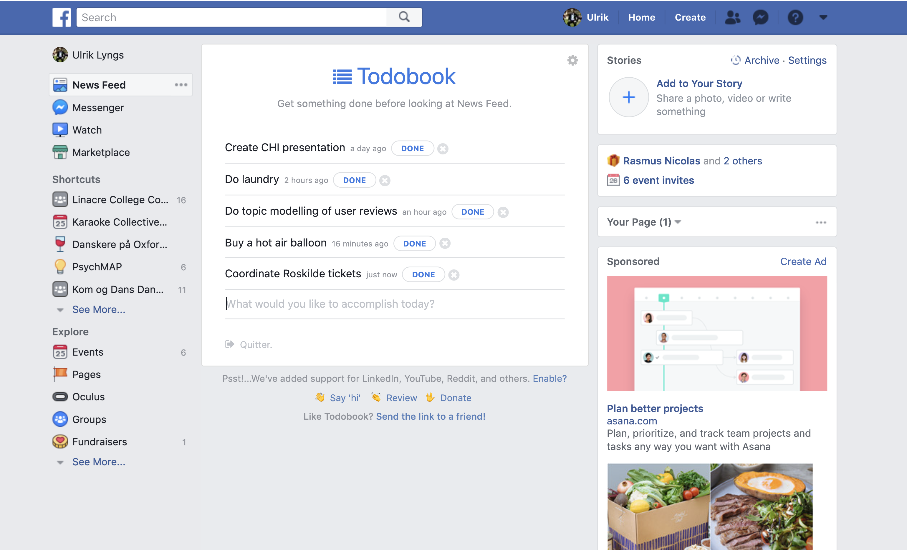
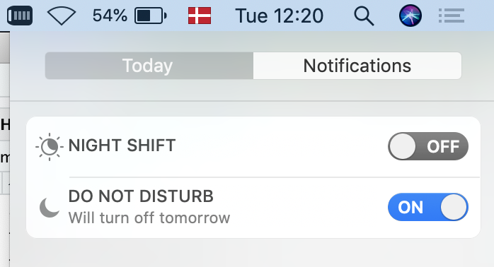

---
output:
  html_document:
    theme: cosmo
    toc: true
    toc_depth: 1
    toc_float: true
    self_contained: false
    number_sections: false
    css: style.css
---


```{r setup, include=FALSE}
knitr::opts_chunk$set(echo = FALSE)
library(tidyverse)
library(knitr)

```


# Block or remove distractions {.tabset}
## Block access
If particular websites or apps distract you, try blocking your access to them for some time or after a certain amount of time has passed.

### Laptop
Many browser extensions allow you to block websites. 
Discover these by searching through the web stores for extensions for the web browser you use:
- [Safari Extensions](https://safari-extensions.apple.com)
- [Chrome Extensions](https://chrome.google.com/webstore/category/extensions?hl=en)
- [Firefox Add-Ons](https://addons.mozilla.org/en-GB/firefox/)

The most popular website blocker for Chrome is [Block Site - Website Blocker for Chrome™](https://chrome.google.com/webstore/detail/block-site-website-blocke/eiimnmioipafcokbfikbljfdeojpcgbh/related?hl=en):
```{r, out.width="45%"}
knitr::include_graphics("figures/chrome_block_setup.png")
knitr::include_graphics("figures/chrome_block_result.png")
```

### Smartphone
On Android, the most popular app blocker is [Stay Focused](https://play.google.com/store/apps/details?id=com.stayfocused&hl=en_GB):

```{r, out.width="45%"}
knitr::include_graphics("figures/stay_focused_block.png")
knitr::include_graphics("figures/stay_focused_limit.png")
#knitr::include_graphics("figures/stay_focused_options.png")
```

On iOS, you can use Apple's built-in app [Screen Time](https://support.apple.com/en-gb/HT208982) to block your own access to particular apps.

To do so, go to **Settings -> Screen Time -> App Limits**

## Remove features
On laptop, use browser extensions to remove features of websites you find distracting.

For example, use extensions to remove Facebook's newsfeed (e.g. with Chrome's [News Feed Eradicator](https://chrome.google.com/webstore/detail/news-feed-eradicator-for/fjcldmjmjhkklehbacihaiopjklihlgg)), or recommended videos from YouTube (e.g. with Safari's [Distraction Blocker for YouTube](https://safari-extensions.apple.com/details/?id=com.robertjeffs.distractionblockerforyoutube-W9AT75TA27)):

```{r, out.width="45%"}
knitr::include_graphics("figures/fb_newsfeed.png")
knitr::include_graphics("figures/youtube_minimal.png")
```

The Chrome extension [Click to Remove Element](https://chrome.google.com/webstore/detail/click-to-remove-element/jcgpghgjhhahcefnfpbncdmhhddedhnk?hl=gb) allows you to remove elements from any website with a single click:

```{r}
knitr::include_graphics("figures/remove_element.jpg")
```

If you use Gmail in a browser, [Inbox When Ready](https://chrome.google.com/webstore/detail/inbox-when-ready-for-gmai/cdedhgmbfjhobfnphaoihdfmnjidcpim?hl=gb) hides your inbox by default, until you deliberately click that you wish to see it:

```{r}
knitr::include_graphics("figures/inbox_ready.jpg")
```

Search through the browser extension stores for a similar extension which might be useful to you:
- [Safari Extensions](https://safari-extensions.apple.com)
- [Chrome Extensions](https://chrome.google.com/webstore/category/extensions?hl=en)
- [Firefox Add-Ons](https://addons.mozilla.org/en-GB/firefox/)

## Minimal writing tools
When you try to focus on writing, consider getting all distractions out of the way.

For smartphones, there are dedicated minimalistic writing tools such as [JotterPad](https://play.google.com/store/apps/details?id=com.jotterpad.x&hl=en&gl=us):

```{r}
knitr::include_graphics("figures/jotterpad.png")
```

If you use Google Docs on laptop, there are browser extensions to make the interface super minimalistic, for example [DistractionFree for Safari](https://safari-extensions.apple.com/details/?id=com.kallepersson.distractionfree-BBWY83BGU8):

```{r}
knitr::include_graphics("figures/google_docs.png")
```

Even Microsoft Word now includes a minimalistic 'Focus' mode:

```{r, out.width="45%"}

knitr::include_graphics("figures/word_focus2.png")
```


## Go monotasking / dumbphone
A few tools can force your devices into 'monotasking' mode. 

### Laptop
[Cold Turkey Writer](https://getcoldturkey.com/writer/) allows you to turn your laptop into a typewriter until you've typed a specific number of words, or for a specific length of time:

```{r}
knitr::include_graphics("figures/cold_turkey.png")
```

### Smartphone
On Android, simulate a similar situation with the app [Dumbphone](https://play.google.com/store/apps/details?id=bg.bozho.dumbphone&hl=en&gl=us):

```{r}
knitr::include_graphics("figures/dumbphone.png")
```

On iOS, get the same effect using [Screen Time](https://support.apple.com/en-gb/HT208982)'s 'Downtime' feature.
When 'Downtime' is scheduled, only phone calls and apps that you choose to allow are available:

```{r, out.width="45%"}
knitr::include_graphics("figures/downtime1.png")
knitr::include_graphics("figures/downtime2.png")
```


# Track yourself {.tabset}
## See how your spend your time
Various tools are available to see how your spend time on your devices, and compare it to your goals.

On **laptop**, one of the most popular tools is [RescueTime](https://www.rescuetime.com): 

```{r}
knitr::include_graphics("figures/rescue_time.png")
```

### Android
On **Android**, apps such as [Usage Time](https://play.google.com/store/apps/details?id=com.agooday.screentime&hl=en&gl=us) provide the same functionality:

```{r}
knitr::include_graphics("figures/app_usage.png")
```

Google provides the same functionality with [Digital Wellbeing](https://play.google.com/store/apps/details?id=com.google.android.apps.wellbeing&hl=en_GB), which is pre-installed on many newer Android devices (Settings > Digital Wellbeing):

```{r}
knitr::include_graphics("figures/digi_wellbeing.jpeg")
```

### iOS
On iOS, [Screen Time](https://support.apple.com/en-gb/HT208982) provides this ability (**Settings -> Screen Time**):

```{r}
knitr::include_graphics("figures/screentime.png")
```


## Work in bursts with a timer
To keep you on track, many people track themselves with a countdown timer.
This is often done with the 'Pomodoro' technique, where you break your work down in intervals, typically 25 minutes, separated by short breaks.

### Laptop
Numerous tools support this, for example [Be Focused](https://xwavesoft.com/be-focused-pro-for-iphone-ipad-mac-os-x.html):

```{r}
knitr::include_graphics("figures/pomodoro.png")
```

You can combine this with blocking distracting websites during work sessions, for example using the Chrome extension [FocusMe](https://chrome.google.com/webstore/detail/focusme-a-pomodoro-timer/koebbleaefghpjjmghelhjboilcmfpad?hl=gb):

```{r}
knitr::include_graphics("figures/focusme.png")
```

### Android
Apps supporting this include [Its Study Time](https://play.google.com/store/apps/details?id=com.deGans.itsStudyTime&hl=en&gl=us):

```{r}
knitr::include_graphics("figures/its_study_time2.png")
```

### iOS
On Apple's devices, tools for this include [Mattie](https://itunes.apple.com/gb/app/sidekick-mattie/id1166327958?mt=8&ign-mpt=uo%3D4):

```{r}
knitr::include_graphics("figures/mattie.jpg")
```

# Advance your goals {.tabset}
## Make new tabs remind you of your goals
On **laptop**, you can make new tabs remind you of what you need to do.

For example, use the Chrome extension [Focus](https://chrome.google.com/webstore/detail/focus/paipcheolflniajdfeglfpddafcklepg?hl=gb) to turn new tabs into a todo-list:

```{r}
knitr::include_graphics("figures/focus_tab.png")
```

This extension also lets you block distracting websites while you focus on a specific task.

Search through the browser extension stores for a similar extension which might be useful to you:
- [Safari Extensions](https://safari-extensions.apple.com)
- [Chrome Extensions](https://chrome.google.com/webstore/category/extensions?hl=en)
- [Firefox Add-Ons](https://addons.mozilla.org/en-GB/firefox/)


## Motivational quotes
On **laptop**, use new tabs to remind you of the important things in life.

For example, use the Chrome extension [Daily Motivation](https://chrome.google.com/webstore/detail/daily-motivation-motivati/nonnkklkpbokmppgochfdamhihaijdin?hl=gb) to put motivational quotes on new tabs:

```{r}
knitr::include_graphics("figures/daily_motivation.png")
```

Search through the browser extension stores for similar extensions for your browser:
- [Safari Extensions](https://safari-extensions.apple.com)
- [Chrome Extensions](https://chrome.google.com/webstore/category/extensions?hl=en)
- [Firefox Add-Ons](https://addons.mozilla.org/en-GB/firefox/)


## Replace Facebook's newsfeed with a todo-list
On **laptop**, you can also replace Facebook's newsfeed with other content.

For example, use the Chrome extension [Todobook](https://chrome.google.com/webstore/detail/todobook/ihbejplhkeifejcpijadinaicidddbde?hl=gb) to replace Facebook's newsfeed with a todo list.

```{r}

```

Search through the browser extension stores for similar extensions for your browser:
- [Safari Extensions](https://safari-extensions.apple.com)
- [Chrome Extensions](https://chrome.google.com/webstore/category/extensions?hl=en)
- [Firefox Add-Ons](https://addons.mozilla.org/en-GB/firefox/)

## Automatically redirect yourself away from distraction 
On **laptop**, automatically redirect yourself away from distracting websites when you need to focus.

For example, use the Chrome extension [Timewarp](https://chrome.google.com/webstore/detail/timewarp/mmmhadpnjmokjbmgamifipkjddhlfkhi?hl=gb):

```{r}
knitr::include_graphics("figures/timewarp.png")
```

Search through the browser extension stores for similar extensions for your browser:
- [Safari Extensions](https://safari-extensions.apple.com)
- [Chrome Extensions](https://chrome.google.com/webstore/category/extensions?hl=en)
- [Firefox Add-Ons](https://addons.mozilla.org/en-GB/firefox/)


## Periodic reminders
Be mindful of what you're supposed to be doing.

For example, use the Chrome extension [Gen4](https://chrome.google.com/webstore/detail/gen4/pjkdlacnjfgkdbpojjfalmehngmlegnd/related?hl=gb) to get periodic reminders of what you're supposed to be doing while browsing the web:

```{r, out.width="50%"}
knitr::include_graphics("figures/gen4.jpg")
knitr::include_graphics("figures/gen4-2.jpg")
```


# Reward or punish yourself {.tabset}
## Protect a virtual creature by sticking with your intentions
To get a little extra push of motivation to use your devices in the way you intended, add a little reward.

One of the most popular tools for this is [Forest](https://www.forestapp.cc/) which lets you grow virtual trees during focus sessions - the trees die if you do not stick with your goal...

```{r, out.width="30%"}
knitr::include_graphics("figures/forest_iphone.png")
knitr::include_graphics("figures/forest_android.png")
knitr::include_graphics("figures/forest_chrome.png")
```

Forest is available for [iOS](https://itunes.apple.com/app/forest-stay-focused-stop-phubbing/id866450515), [Android](https://play.google.com/store/apps/details?id=cc.forestapp), and as a [Chrome extension](https://chrome.google.com/webstore/detail/forest-stay-focused-be-pr/kjacjjdnoddnpbbcjilcajfhhbdhkpgk).

Other options include [Feed the Goat (Chrome Extension)](https://docs.google.com/spreadsheets/d/1BVBCBOZQY_K7qYmDiSIail07F6D1iDG1OkoFyazb5Y4/edit#gid=777024457) or [Flora (iOS)](https://itunes.apple.com/us/app/flora-focus-study-pomodoro/id1225155794?mt=8&ign-mpt=uo%3D4):

```{r, out.width="45%"}
knitr::include_graphics("figures/flora.png")
knitr::include_graphics("figures/feed_goat.png")
```

## Writing under pressure
The online tool [The Most Dangerous Writing App](https://www.themostdangerouswritingapp.com) helps you get into the flow of writing by adding pressure:
Set a target word count or duration, begin typing, and if you stop typing for more than a few seconds before you hit the goal, all you have typed is deleted!
Perfect for simulating the feeling of being so close to a deadline that procrastination is no longer an option!

```{r}
knitr::include_graphics("figures/worlds_dangerous.png")
```

# Change your digital environment {.tabset}
## Go grey-scale (smartphone)
A simple way to make your smartphone less distracting is to turn it greyscale when you do not need color.

```{r}
knitr::include_graphics("figures/greyscale.png")
```

On iPhone, set a triple-tap on the Home button to toggle grey scale on and off:
- **Settings > Accessibility > Accessibility Shortcut > Colour Filters**

Newer versions of the Android operating system may include a gray scale toggle in your phone's quick settings.

## Arrange your apps (smartphone)
Arrange your apps so that the home screen is minimalistic and simple, and so that the apps you'd like to use less often require a bit more effort to reach.

For example, limit your first page of apps to only apps you use for quick in-and-out tasks - move the rest of your apps, especially mindless choices, off the first page and into folders.

```{r, out.width="45%"}
knitr::include_graphics("figures/off_page.png")
knitr::include_graphics("figures/off_page2.png")
```

## Do not disturb during set hours
Schedule do not disturb, so that during certain hours (e.g. 9pm to 8am) only calls from your favorite contacts go through directly.

```{r}
knitr::include_graphics("figures/do_not_disturb.png")
```

*Wind Down* on newer versions of Android also provides this feature, as well as the ability to automatically turn your phone greyscale when getting ready for bed.

## Manage notifications
Be ruthless about which apps you give the ability to send you notifications.

On **iOS**, go to **Settings > Notifications** and carefully consider which apps should be allowed to disturb you.

On a **Mac**, newer operating systems also include a Do Not Disturb mode, for when you need to focus without having popups about incoming email etc.:

```{r}

```

## Use full-screen (laptop)
On a laptop, try limiting the amount of information available to you to what you actually need for your task.

On **Mac**, one way to do this is by using full screen mode to e.g. put two tools you need side by side:

```{r, fig.cap="Rather than this..."}
knitr::include_graphics("figures/full_screen1.png")
```

```{r, fig.cap="... try this"}
knitr::include_graphics("figures/full_screen_2.png")
```

